# Realice el seguimiento de donaciones con Blockchain
Cree, configure e interactúe con IBM Blockchain Platform a través de Hyperledger Composer Playground y del servidor REST de Hyperledger Composer

## Summary

Imagine lo que podría ocurrir si cada ciudadano tuviera la confianza de que se están honrando los compromisos filantrópicos para ayudar a las problemáticas sociales y que los recursos estuviesen llegando a las personas que tienen mas necesidades. Que se puedan asegurar de que todos los dólares que donan estén causando un impacto real. ¿Un sistema más transparente no motivaría a las personas para que fuesen más propensas a defender causas que merecen la pena? O, aun mejor ¿que las inspirarse a donar más?

Blockchain puede proporcionar la transparencia y la responsabilidad que exigen los ciudadanos. Complete este Code Pattern para utilizar IBM Blockchain Platform para construir una red de tres miembros en la que los compromisos específicos para una causa y las transferencias de fondos se realicen por el gobierno, se registren por las organizaciones de ayuda y sean validas por Global Citizen

## Requisitos Previos
 
1. Cuenta gratuita en [IBM Cloud](https://www.ibm.com/cloud/)

2. [NPM](https://www.npmjs.com/) y Node instalado (node version 8.10.0)

3. Si ha usado otras versiones de composer-cli, o ha implementado un archivo .bna antes, ejecute estos comandos
```
npm uninstall -g composer-cli
npm uninstall -g composer-rest-server
rm -rf ~/.composer
rm *.card
rm -rf credentials/
```

4. Instalar composer-cli
```bash
npm install -g composer-cli@0.20
```
## Flujo


1. Crear y enviar una propuesta de compromiso a la organización Global Citizen para su revisión

2. Enviar la propuesta de compromiso a la organización gubernamental por los fondos

3. Actualizar la propuesta de compromiso con las especificaciones de financiación

4. Transferir fondos de acuerdo a la propuesta de compromiso.

## Pasos

1. [Generar el archivo de red de negocios (BNA)](#1)

2. [Crear el servicio de Blockchain](#2)

3. [Obtener el secreto](#3)

4. [Use el secreto para obtener certificados de la autoridad de certificación](#4)

5. [Use el archivo admin-pub.pem para agregar certificados a los pares](#5)

6. [Crear tarjeta de red de negocios de administración](#6)

7. [Instalar el runtime e iniciar la red.](#7)

8. [Crear una nueva tarjeta de red de negocios.](#8)

9. [Interactuar con la red de negocios](#9)

## 1. Generar el archivo de red de negocios (BNA)

Una red de negocios está formada por activos, participantes, transacciones, reglas de control de acceso y, opcionalmente, eventos y consultas. En esta estructura de red de negocios, hay un archivo modelo (**.cto**) que contendrá las definiciones de clase para todos los activos, participantes y transacciones en la red de negocios. La estructura de esta red de negocios, también contiene un documento de control de acceso(**permissions.acl**) con reglas de control de acceso básicas, un archivo de script(**logic.js**) que contiene funciones del proceso de transacciones y un archivo **package.json** que contiene metadatos de la red de negocios.

Primero necesitamos clonar un repositorio que contenga los tres componentes necesarios para crear un archivo BNA: un archivo lógico(**.js**), un archivo modelo (**.cto**) y un archivo de control de acceso(**.acl**).
```bash
git clone https://github.com/IBMInnovationLabUY/seguimiento-de-donaciones-con-blockchain.git
```

Para verificar que la estructura de los archivos es válida, ahora puede generar un Business Network Archive (BNA) para su definición de red de negocios. El archivo BNA es la unidad desplegable, un archivo que se puede implementar en el tiempo de ejecución de Composer para su ejecución. Use el siguiente comando para generar el archivo de red:
```bash
cd seguimiento-de-donaciones-con-blockchain
npm install
```

Deberías ver el siguiente resultado:

```bash
Creating Business Network Archive


Looking for package.json of Business Network Definition
	Input directory: /Users/ishan/Documents/proj/global-citizens/global-citizens-network/global-citizen

Found:
	Description: This pattern should be able to Construct a 3-member blockchain application using the IBM Blockchain Platform, consisting of the following entities: an organization representing a government entity, an organization representing an NGO focused on the provision of aid, and an organization representing Global Citizen.
	Name: global-citizens-network
	Identifier: global-citizens-network@0.0.1

Written Business Network Definition Archive file to
Output file: global-citizens-network@0.0.1.bna

Command succeeded
```
Ahora debería tener un archivo BNA, (global-citizens-network.bna), ubicado en el directorio `global-citizens/dist` 

## 2. Crear el servicio de Blockchain

1. En su navegador vaya a su [cuenta de IBM Cloud](https://console.bluemix.net/dashboard/apps)

2. Crear un servicio de blockchain: 
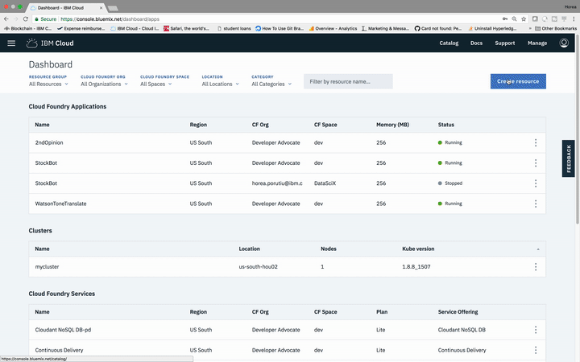

## 3. Obtener el secreto

1. Inicie su servicio blockchain, haga clic en el perfil de conexión y seleccione para ver el archivo JSON

2. Vaya hacia abajo hasta que vea `registrar` luego bajo  `enrollId` habrá enrollSecret `enrollSecret`.Copie este secreto, lo necesitaremos para el próximo paso para crear una tarjeta de red de negocios para la autoridad de certificación (CA) 


## 4. Use el secreto para obtener certificados de la autoridad de certificación

1. Descarga el connection profile

2. Renombra el archivo JSON descargado a `connection-profile.json`

3. Mueve el archivo `connection-profile.json`  a el directorio `global-citizen`

4. Utilice el `enrollSecret` del paso anterior en el siguiente comando para crear una tarjeta de red de negocios para el certificate authority (CA)
```bash
composer card create -f ca.card -p connection-profile.json -u admin -s <enrollSecret>
```

5. Importe la tarjeta en la billetera de su sistema local con este comando

```bash
composer card import -f ca.card -c ca
```
  
6. Finalmente, solicitamos certificados de la CA usando la tarjeta que importamos que contiene nuestro `enrollSecret`. Los certificados se almacenan en el directorio de credenciales que se crea después de completar este comando.
```bash
composer identity request --card ca --path ./credentials
```

## 5. Use el archivo admin-pub.pem para agregar certificados a los pares

1. De vuelta en el servicio blockchain, haga clic en la pestaña de miembros, luego agregue el certificado. Vaya a su directorio `global-citizen/credentials`, y copie y pegue el contenido del archivo `admin-pub.pem`  en el cuadro de certificado. Presentar el certificado y reiniciar los pares. 
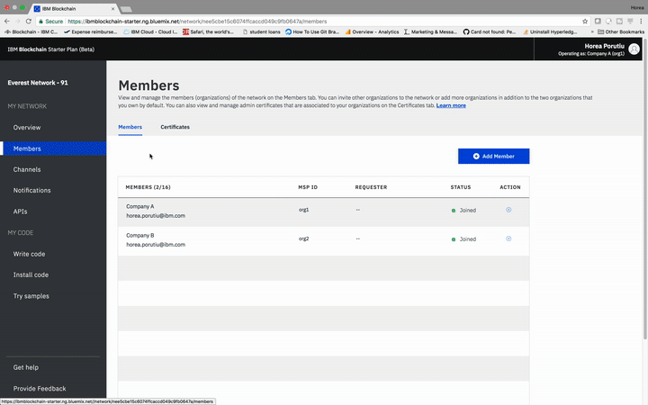
>Nota: reiniciar los pares toma un minuto.

2. A continuación, necesitamos sincronizar los certificados del canal. Desde nuestro servicio de blockchain, `my network`haga clic en `Channels` y luego el botón de tres puntos. Luego haga clic en `Sync Certificate`. 
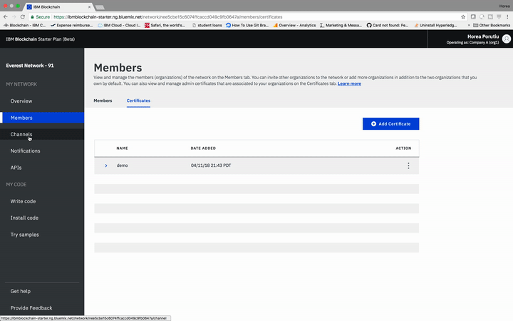

## 6. Crear tarjeta de red de negocios de administración

1. Ahora que hemos sincronizado los certificados con nuestros pares, podemos instalar el runtime de Hyperledger Composer e iniciar la red creando una tarjeta de administración. Cree la tarjeta de administración con los roles de administrador de canal y administración de igual con el siguiente comando:
```bash
composer card create -f adminCard.card -p connection-profile.json -u admin -c ./credentials/admin-pub.pem -k ./credentials/admin-priv.pem --role PeerAdmin --role ChannelAdmin
```

2. Importe la tarjeta creada a partir del comando anterior:
```bash
composer card import -f adminCard.card -c adminCard
```

## 7. Instalar el runtime e iniciar la red

1. Ahora usaremos la tarjeta de administración para instalar la red con el siguiente comando:
```bash
composer network install --card adminCard --archiveFile global-citizens-network@0.0.1.bna
```
>Nota: Si recibe un error en este momento, espere un minuto e intente nuevamente.

2. Inicie la red de negocios proporcionando la tarjeta de administración, la ruta al archivo .bna y las credenciales recibidas de la CA. Este comando emitirá una tarjeta que eliminaremos, llamada `delete_me.card`.
```bash
composer network start --networkName global-citizens-network --networkVersion 0.0.1 -c adminCard -A admin -C ./credentials/admin-pub.pem -f delete_me.card
```
>Nota: Si recibe un error en este momento, espere un minuto e intente nuevamente.

3. A continuación, vamos a eliminar delete_me.card:
```bash
rm delete_me.card
```

## 8. Crear una nueva tarjeta de red de negocios

1. Después de instalar el runtime y comenzar la red, debemos crear una tarjeta que implementaremos en el Plan de Inicio. Usa el siguiente comando para crear  `adminCard.card`:
```bash
composer card create -n global-citizens-network -p connection-profile.json -u admin -c ./credentials/admin-pub.pem -k ./credentials/admin-priv.pem
```

2. Importar la tarjeta de red de negocios:
```bash
composer card import -f admin@global-citizens-network.card
```

3. Prueba la tarjeta de red de negocios:
```bash
composer network ping -c admin@global-citizens-network
```

## 9. Interactuar con la red de negocios

Puede utilizar composer-playground o composer-rest-server para interactuar con la red de negocios.


Utilice los enlaces para obtener más información sobre [composer-playground](https://hyperledger.github.io/composer/latest/introduction/introduction) y [composer-rest-server](https://hyperledger.github.io/composer/latest/integrating/getting-started-rest-api).

### a. Interactuar utilizando Composer-Playground

1. Instale Composer-Playground:
```bash
npm install -g composer-playground@0.20
```
2. Ahora, vamos a iniciar el servidor. Asegúrese de estar en el mismo directorio que su `connection-profile.json`
```bash
composer-playground
```
3. En su navegador, vaya a [http://localhost:8080/test](http://localhost:8080/test) para realizar operaciones en la red de negocios.
`Admin card` La red de negocios para global-citizen se crea en Composer Playground.

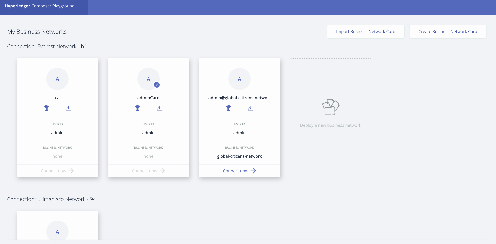

Haga clic en el boton`Connect now`presente en la tarjeta `admin@global-citizens-network` para conectarse a la red de negocios de global-citizen.

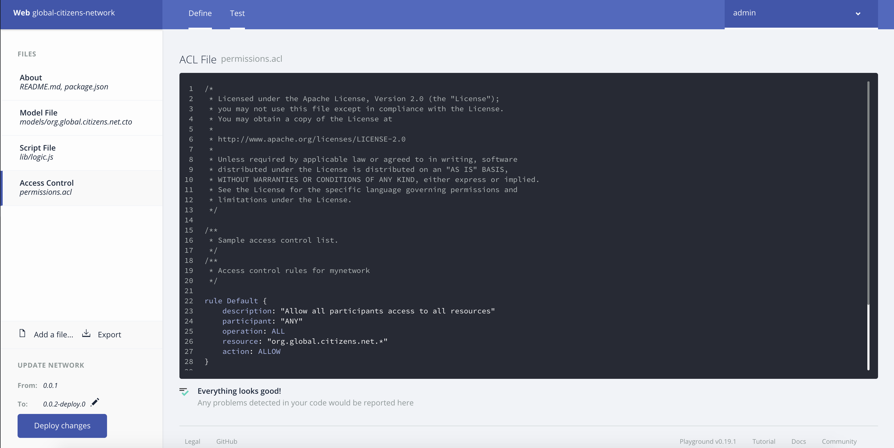

Para probar su definición de red de negocios, primero haga clic en la pestaña : **Test**

En el registo de participantes `AidOrg`, cree un nuevo participante. Asegurese primero de hacer clic en el tab `AidOrg` y luego en el botón `Create New Participant`

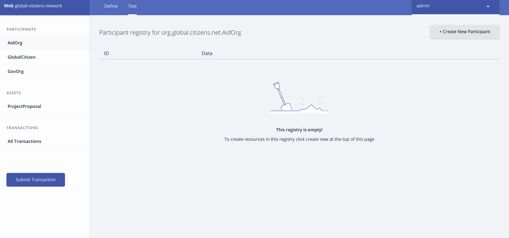

Rellene los datos para el participante y haga clic en `Create New`

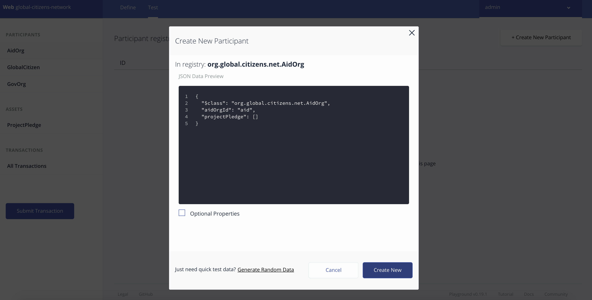


Nuevo participante `AidOrg` creado en el registro. Del mismo moro crea los otros participantes para la red.

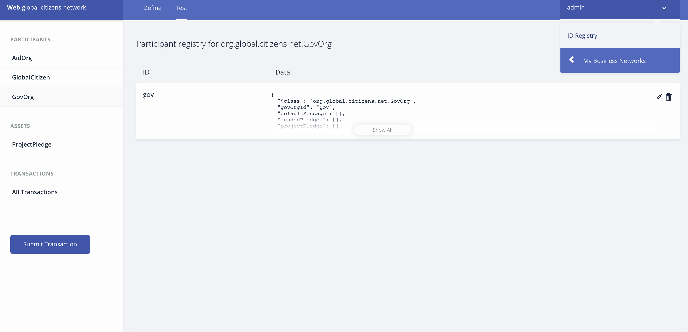

Los perfiles de conexión contienen la información necesaria para conectarse a una estructura. Las tarjetas de red de negocios combinan un perfil de conexión, identidad y certificados para permitir la conexión a una red de negocios en Hyperledger Composer Playground.

Ahora estamos listos para agregar **Tarjetas de Red** para los participantes en la red. Haga esto primero haciendo clic en la pestaña `admin` y seleccione `ID Registry` para emitir **Nuevas Identificaciones** para los participantes y agregarlas a la billetera. Por favor, siga las instrucciones que se muestran en las imágenes a continuación: 

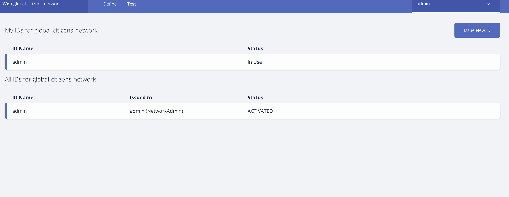

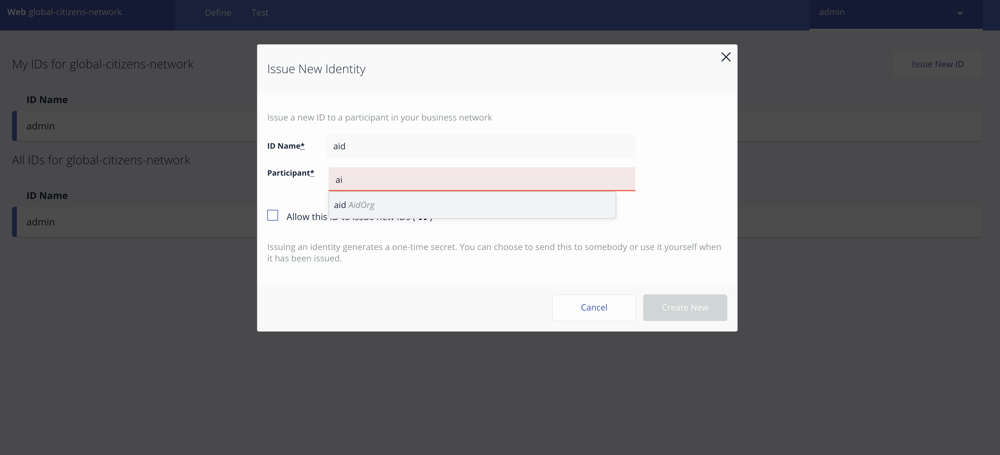

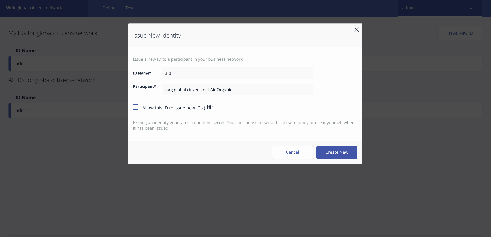

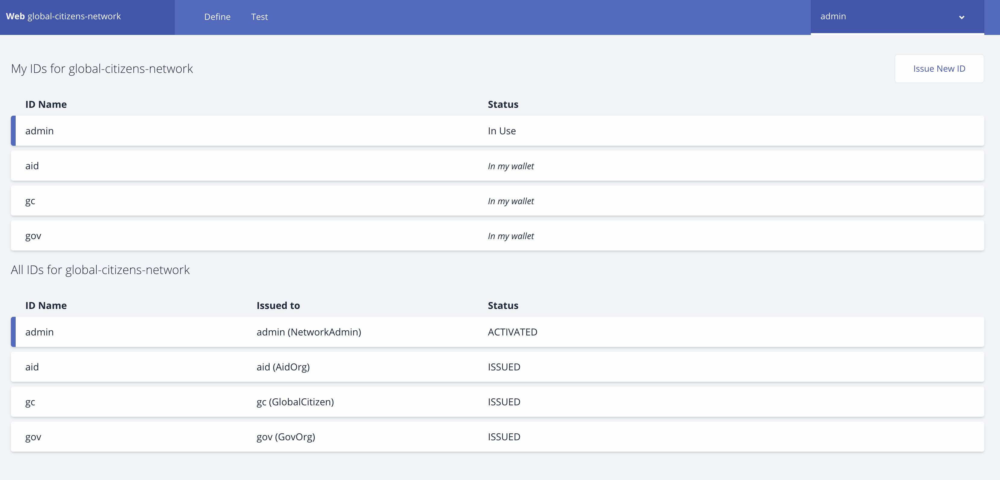

Haga clic en  `Use Now` para seleccionar el registro de participantes `AidOrg` para realizar transacciones en la red. 

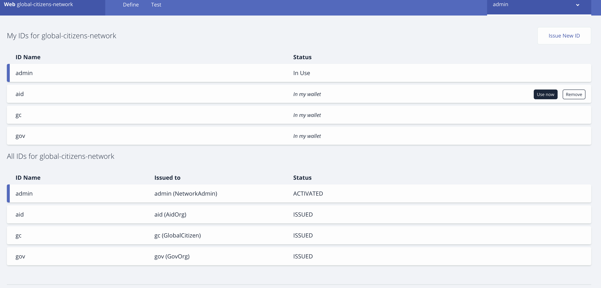

Ejecute la transacción `CreateProjectPledge`.
```
{
  "$class": "org.global.citizens.net.CreateProjectPledge",
  "pledgeId": "p1",
  "name": "child care",
  "decription": "child care fund",
  "fundsRequired": 100000,
  "aidOrg": "resource:org.global.citizens.net.AidOrg#aid"
}
```
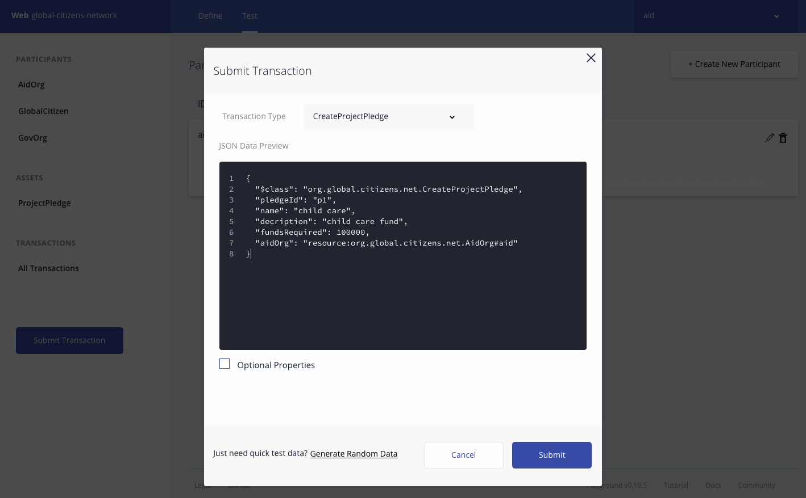

El nuevo compromiso del proyecto se crea en el Registro de Activos. 

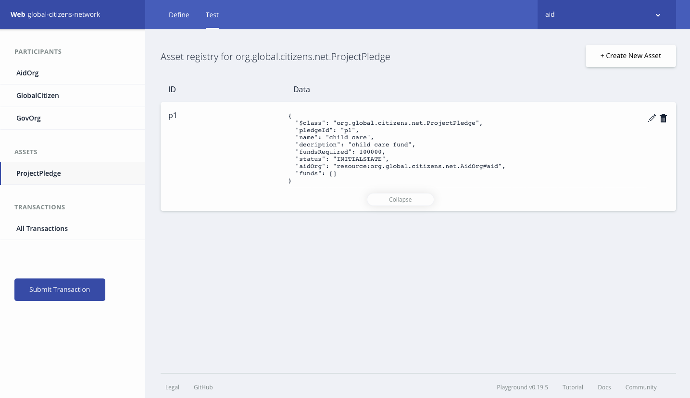
Envíe la transacción `SendPledgeToGlobalCitizen`  para enviar el compromiso a global citizen para obtener los fondos para el proyecto.
```
{
  "$class": "org.global.citizens.net.SendPledgeToGlobalCitizen",
  "citizenId": "resource:org.global.citizens.net.GlobalCitizen#gc",
  "pledgeId": "resource:org.global.citizens.net.ProjectPledge#p1"
}
```


El registro de participantes de Global Citizen se actualiza con la nueva solicitud de compromiso.

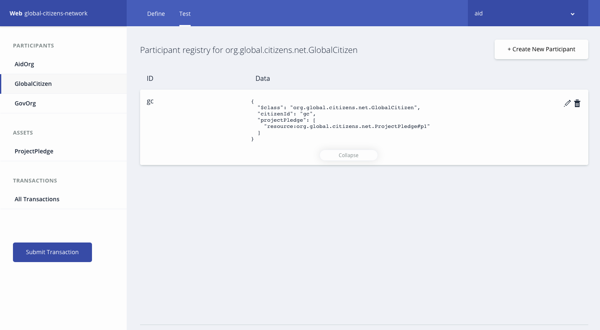

Global Citizen revisa el compromiso. Después de la verificación exitosa, envía una transacción `SendPledgeToGovOrg` para obtener fondos para el compromiso del proyecto de las organizaciones gubernamentales.

```
{
  "$class": "org.global.citizens.net.SendPledgeToGovOrg",
  "govOrg": ["resource:org.global.citizens.net.GovOrg#gov"],
  "pledgeId": "resource:org.global.citizens.net.ProjectPledge#p1"
}
```
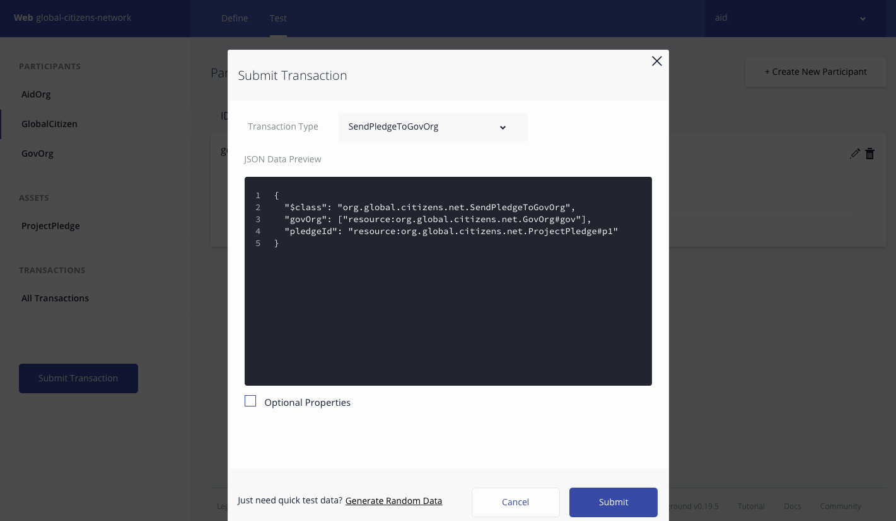

Las organizaciones gubernamentales revisan el compromiso. Después de revisar si deciden financiar el proyecto, envían una transacción `UpdatePledge` para actualizar el activo de compromiso del proyecto.

```
{
  "$class": "org.global.citizens.net.UpdatePledge",
  "govOrgId": "resource:org.global.citizens.net.GovOrg#gov",
  "pledgeId": "resource:org.global.citizens.net.ProjectPledge#p1",
  "fundingType": "WEEKLY",
  "approvedFunding": 100000,
  "fundsPerInstallment": 1000
}
```
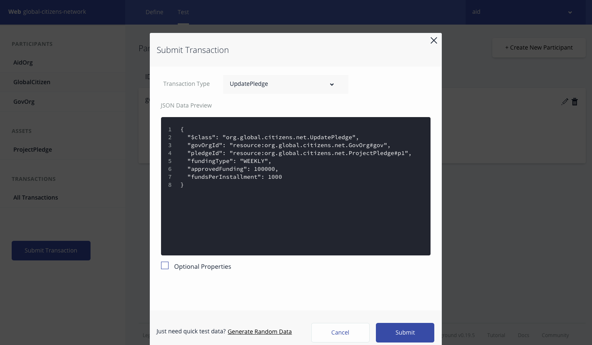

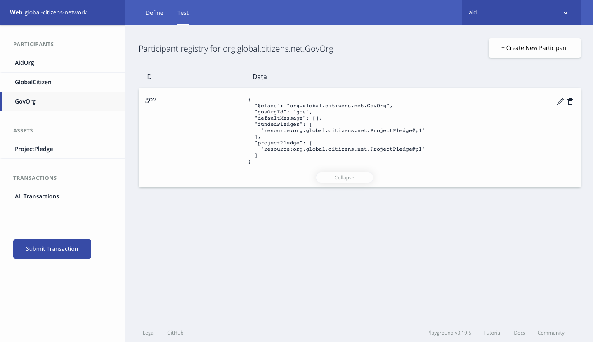

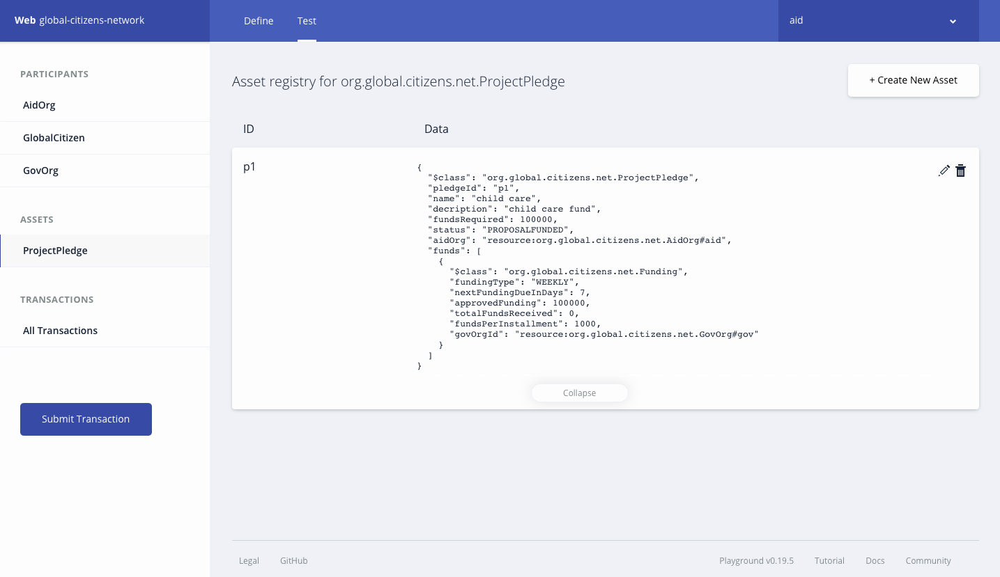

Las organizaciones gubernamentales envían periódicamente los fondos al proyecto mediante el envío de la transacción  `TransferFunds`.
```
{
  "$class": "org.global.citizens.net.TransferFunds",
  "govOrgId": "resource:org.global.citizens.net.GovOrg#gov",
  "pledgeId": "resource:org.global.citizens.net.ProjectPledge#p1"
}
```
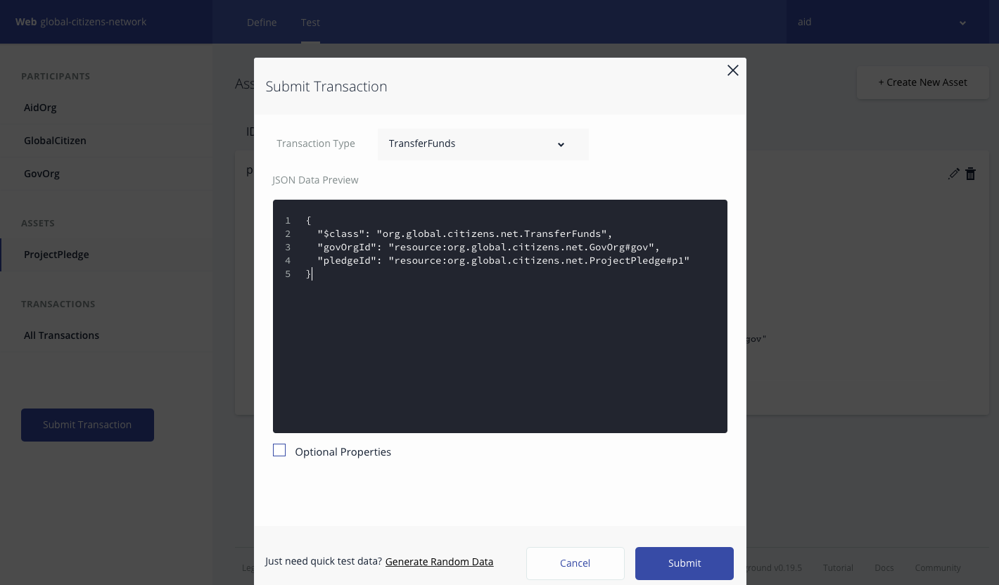

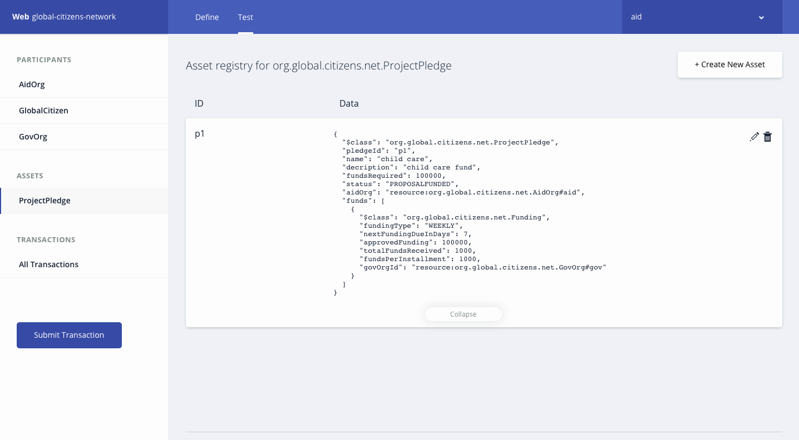

### b. Interactuar utilizando composer-rest-server

1. Instala el composer-rest-server:
```bash
npm install -g composer-rest-server@0.20
```

2. Ahora, vamos a iniciar el servidor. Asegúrese de estar en el mismo directorio que su `connection-profile.json`
```bash
composer-rest-server -c admin@global-citizens-network -n never -w true
```

3. En su navegador, vaya a [http://localhost:3000/explorer](http://localhost:3000/explorer)

4. Ahora puede utilizar la api swagger para realizar operaciones en la red empresarial como se muestra en [Interact using Composer-Playground](#a-interactuar-utilizando-composer-playground)

## Retos 

1. Añadir permisos de red
2. Implementar cuadros de mando
3. Implementar lógica para el seguimiento de pagos por defecto.
4. Implementar la lógica de notificación
5. Mejorar la lógica del fondo de transferencia.

## Recursos Adicionales

* [Hyperledger Fabric Docs](http://hyperledger-fabric.readthedocs.io/en/latest/)
* [Hyperledger Composer Docs](https://hyperledger.github.io/composer/latest/introduction/introduction.html)

