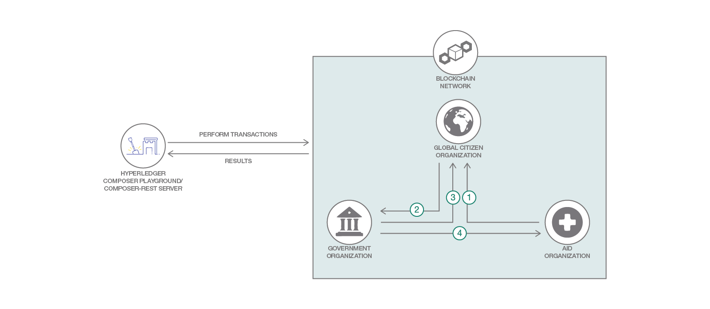

# Realice el seguimiento de las donaciones con Blockchain
Cree, configure e interactúe con IBM Blockchain Platform a través de Hyperledger Composer Playground y del servidor REST de Hyperledger Composer

## Summary

Imagine lo que podría ocurrir si cada ciudadano tuviera la confianza de que se están honrando los compromisos filantrópicos para ayudar a las problemáticas sociales y que los recursos estuviesen llegando a las personas que tienen mas necesidades. Que se puedan asegurar de que todos los dólares que donan estén causando un impacto real. ¿Un sistema más transparente no motivaría a las personas para que fuesen más propensas a defender causas que merecen la pena? O, aun mejor ¿que las inspirarse a donar más?

Blockchain puede proporcionar la transparencia y la responsabilidad que exigen los ciudadanos. Complete este Code Pattern para utilizar IBM Blockchain Platform para construir una red de tres miembros en la que los compromisos específicos para una causa y las transferencias de fondos se realicen por el gobierno, se registren por las organizaciones de ayuda y sean validas por Global Citizen

## Requisitos Previos
 
1. Cuenta gratuita en [IBM Cloud](https://www.ibm.com/cloud/)

2. [NPM](https://www.npmjs.com/) y Node instalado (node version 8.10.0)

3. Si ha usado otras versiones de composer-cli, o ha implementado un archivo .bna antes, ejecute estos comandos
```
npm uninstall -g composer-cli
npm uninstall -g composer-rest-server
rm -rf ~/.composer
rm *.card
rm -rf credentials/
```

4. Instalar composer-cli
```bash
npm install -g composer-cli@0.20
```
## Flujo


1. Crear y enviar una propuesta de compromiso a la organización Global Citizen para su revisión

2. Enviar la propuesta de compromiso a la organización gubernamental por los fondos

3. Actualizar la propuesta de compromiso con las especificaciones de financiación

4. Transferir fondos de acuerdo a la propuesta de compromiso.

## Steps

1. [Generar el archivo de red de negocios (BNA)](#1)

2. [Crear Servicio Blockchain](#2)

3. [Obtener el secreto](#3)

4. [Use el secreto para obtener certificados de la autoridad de certificación](#4)

5. [Use el archivo admin-pub.pem para agregar certificados a los miembros](#5)

6. [Crear tarjeta de red de negocios de administración](#6)

7. [Instalar runtime e iniciar la red.](#7)

8. [Crear una nueva tarjeta de red de negocios.](#8)

9. [Interactuar con la red de negocios](#9)

## 1. Generar el archivo de red de negocios (BNA)

Una red de negocios está formada por activos, participantes, transacciones, reglas de control de acceso y, opcionalmente, eventos y consultas. En esta estructura de red de negocios, hay un archivo modelo (**.cto**) que contendrá las definiciones de clase para todos los activos, participantes y transacciones en la red de negocios. La estructura de esta red de negocios, también contiene un documento de control de acceso(**permissions.acl**) con reglas de control de acceso básicas, un archivo de script(**logic.js**) que contiene funciones del proceso de transacciones y un archivo **package.json** que contiene metadatos de la red de negocios.

Primero necesitamos clonar un repositorio que contenga los tres componentes necesarios para crear un archivo BNA: un archivo lógico(**.js**), un archivo modelo (**.cto**) y un archivo de control de acceso(**.acl**).
```bash
git clone https://github.com/IBMInnovationLabUY/seguimiento-de-donaciones-con-blockchain.git
```

Para verificar que la estructura de los archivos es válida, ahora puede generar un Business Network Archive (BNA) para su definición de red de negocios. El archivo BNA es la unidad desplegable, un archivo que se puede implementar en el tiempo de ejecución de Composer para su ejecución. Use el siguiente comando para generar el archivo de red:
```bash
cd global-citizen
npm install
```

Deberías ver el siguiente resultado:

```bash
Creating Business Network Archive


Looking for package.json of Business Network Definition
	Input directory: /Users/ishan/Documents/proj/global-citizens/global-citizens-network/global-citizen

Found:
	Description: This pattern should be able to Construct a 3-member blockchain application using the IBM Blockchain Platform, consisting of the following entities: an organization representing a government entity, an organization representing an NGO focused on the provision of aid, and an organization representing Global Citizen.
	Name: global-citizens-network
	Identifier: global-citizens-network@0.0.1

Written Business Network Definition Archive file to
Output file: global-citizens-network@0.0.1.bna

Command succeeded
```
Ahora debería tener un archivo BNA, (global-citizens-network.bna), ubicado en el directorio `global-citizens/dist` 
